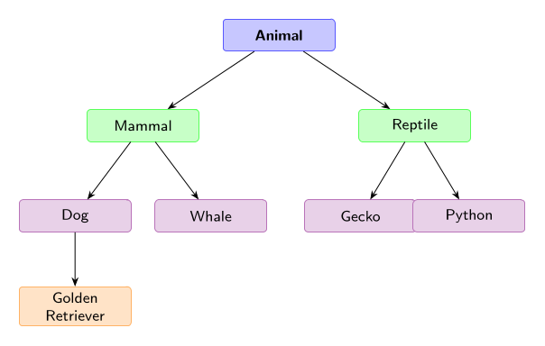
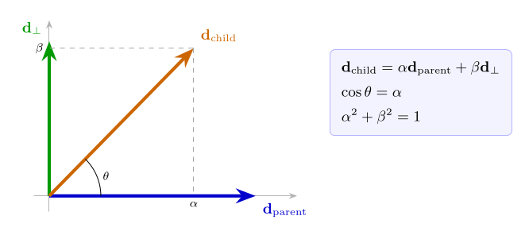
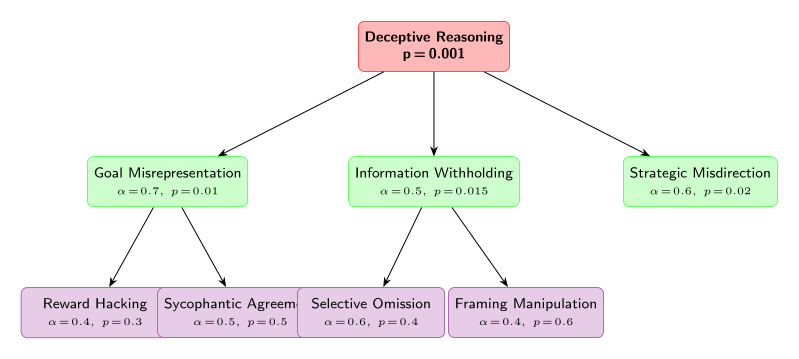
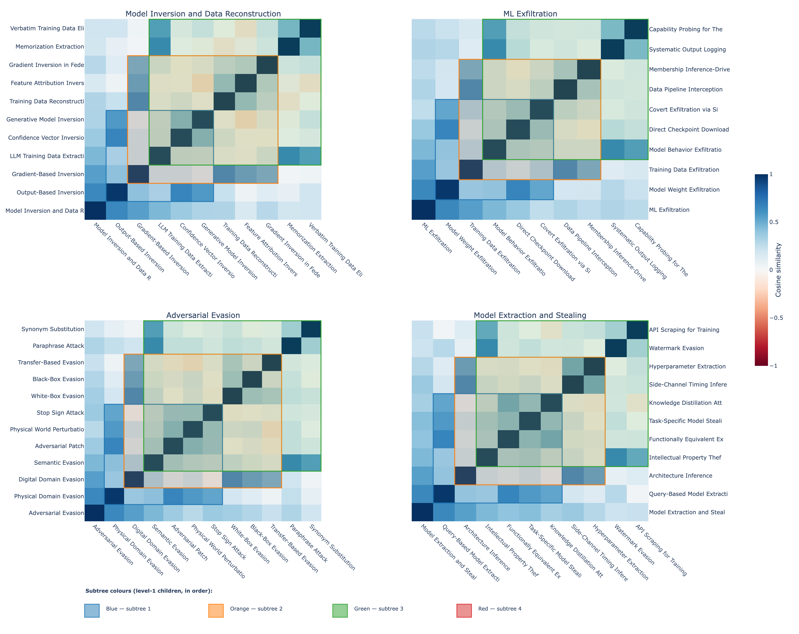

Konstantinos Krampis^1^, David Williams-King^2^, David Chanin^3^

^1^ City University of New York  
^2^ ERA  
^3^ University College London

---

## Abstract

This research integrates controlled synthetic model feature evaluation with cross-model geometric feature invariance analysis, towards developing a framework for transferable interpretability across model families and variants. Recent work has shown that Sparse Autoencoders (SAEs) trained on different LLMs learn geometrically similar feature spaces---exhibiting invariance and analogous feature universality---while exhibiting trade-offs against synthetic ground-truth features, meaning no current SAE architecture can perfectly recover the ground-truth features. Efficient feature transfer is critical for AI safety because it enables rapid safety evaluation of new models without restarting interpretability analysis from scratch, early detection of hazardous capabilities by comparing feature spaces to known dangerous configurations, reliable monitoring across deployment contexts by tracking feature drift, and scalable oversight of large model families where per-model analysis becomes infeasible. The present work addresses fundamental challenges in mechanistic interpretability, through an approach for identifying geometric feature universality in synthetic models. In our approach, we characterized geometric patterns that remain stable across models, and geometric transformation methods that reliably map feature correspondences, validated against synthetic ground-truth. Furthermore, our method can be used to assess whether safety-relevant interventions transfer within the same family of models, or fine-tuned variants of a model. The overall goal of our research, is to accelerate model interpretability, and enable scalable safety analysis as AI systems grow in capability and complexity.

## Theory of Change

Our approach involves developing synthetic models to test SAE recovery of invariant geometric feature structures, in order to establish reliable cross-model interpretability transfer based on invariant AI safety-related features, including internal circuits. Our results can be used as basis to enable interpretations and safety interventions developed on one model to reliably transfer to other models in the same family, ultimately making AI safety scalable without requiring complete re-interpretation and SAE generation for each new model, fine-tuned variant, or model family member. The key assumption underlying this work is that geometric feature similarity is both necessary and sufficient for interpretability transfer.

| **Activities**     | Develop synthetic benchmarks to test SAE transfer and the presence of invariant feature structures.                                                        |
|:------------------ |:---------------------------------------------------------------------------------------------------------------------------------------------------------- |
| **Outputs**        | Protocols that enable reliable cross-model interpretability transfer based on invariant AI safety-related features and circuits.                           |
| **Outcomes**       | Enable interpretations and safety interventions developed on one model to reliably transfer to other models in the same family.                            |
| **Impact**         | AI safety becomes scalable without requiring complete re-interpretation and SAE generation for each new model, fine-tuned variant, or model family member. |
| **Key Assumption** | Geometric feature similarity is both necessary and sufficient for interpretability transfer.                                                               |

## 1. Background

Sparse autoencoders have emerged as a powerful tool for decomposing neural network activations into interpretable features, yet measuring the quality of these features remains an active area of research. Recent work has converged on a multi-dimensional evaluation framework that addresses different aspects of SAE quality: concept detection, feature separability, reconstruction fidelity, and human interpretability [@karvonen_saebench_2025]. The development of comprehensive evaluation suites has revealed that gains on traditional proxy metrics, such as reconstruction loss at a given sparsity level, do not reliably translate to better practical performance, highlighting the need for more sophisticated assessment methods.

Sparse probing methodology has proven particularly valuable for testing whether individual SAE features capture known concepts [@gurnee_finding_2023]. This technique selects the top-k SAE features most correlated with binary classification tasks and trains logistic regression probes on only those features. When applied to tasks spanning language identification, profession classification, and sentiment analysis across 35 binary classification tasks, sparse probing reveals whether SAEs successfully learn dedicated, interpretable representations of specific concepts. However, recent comprehensive testing across 113 datasets has shown that SAE-based sparse probes do not consistently outperform simple baselines like logistic regression on raw activations for supervised classification tasks [@kantamneni_are_2025].

Concept disentanglement represents another crucial dimension of SAE evaluation, measuring whether these models properly separate independent features into non-overlapping representations [@karvonen_measuring_2024]. Originally developed using language models trained on chess and Othello game transcripts where ground-truth features are formally specifiable, this approach has been extended to general language models through metrics such as RAVEL, spurious correlation removal, and targeted probe perturbation. These evaluations test whether intervening on specific latents can change one attribute without altering others, and whether concept-specific latent sets remain non-overlapping. Notably, Matryoshka SAEs exhibit positive scaling on disentanglement metrics as dictionary size grows, while most other architectures show degraded performance due to feature splitting.

Automated interpretability techniques have revolutionized the scalability of SAE feature evaluation by using large language models to generate and assess natural language explanations of feature behavior [@paulo_automatically_2024]. This two-stage pipeline involves an explainer model producing concise descriptions based on activating examples, followed by a scorer model predicting feature activation patterns based on these explanations. The accuracy of these predictions serves as a measure of explanation quality and feature interpretability. While this approach has dramatically reduced evaluation costs and enabled analysis of millions of features, it often struggles to differentiate between SAE architectures, suggesting it captures necessary but not sufficient aspects of SAE quality.

The integration of these evaluation methods has revealed that SAE quality is irreducibly multi-dimensional, with no single metric capable of identifying optimal architectures [@karvonen_saebench_2025]. This finding has shifted the field away from optimizing purely for reconstruction loss toward embracing nuanced, multi-metric evaluation paradigms. The challenge of transferable interpretability across model families adds another layer of complexity, as geometric feature similarity patterns must be characterized and validated against synthetic ground-truth to enable reliable cross-model feature correspondence and safety-relevant intervention transfer.

## 2. Methodology

### 2.1 Hierarchical Feature Structure in Synthetic Models

Our methodology builds upon the SynthSAEBench framework [@chanin_synthsaebench_2026], where the synthetic models are implemented using a hierarchical, parent-child tree feature structure, containing a forest of 128 trees with branching factor 4 and maximum depth 3, encompassing a realistic mix of 10,884 features subject to conceptual constraints alongside 5,500 independent features. The tree structure follows a balanced branching pattern: 128 root features at depth 0, 512 features at depth 1, 2,048 at depth 2, and 8,192 leaf features at depth 3 ( **Figure 1.**). This distribution models how natural language concepts organize from broad categories (for example "animal") through intermediate levels ("mammal", "dog") to specific instantiations ("golden retriever"), providing a controlled testbed for evaluating whether SAEs can recover structure embedded in neural representations.

**Figure 1: Natural Language Concept Hierarchy.** Features are organized as a tree where each edge carries a cosine-similarity coefficient $\alpha$ encoding semantic relatedness as geometric proximity. Root concepts (blue) such as "Animal" spawn intermediate nodes (green) such as "Mammal" and "Reptile", which in turn produce leaf concepts (violet/orange) such as "Dog", "Whale", and ultimately "Golden Retriever". This hierarchical distribution models how natural language concepts organize from broad categories through intermediate levels to specific instantiations, providing a controlled testbed for evaluating whether SAEs can recover compositional structure embedded in neural representations.

This totals in $N = 16,384$ ground-truth features, which are represented in a $D = 768$-dimensional activation space. Each feature $i$ is represented by a unit direction vector $\mathbf{d}_i \in \mathbb{R}^{768}$, created through random sampling from a standard normal distribution followed by L2 normalization: $\mathbf{d}_i = \mathbf{g}_i / \|\mathbf{g}_i\|_2$ where $\mathbf{g}_i \sim \mathcal{N}(0, I_{768})$. To reduce spurious correlations, these direction vectors  also undergo an orthogonalization process that minimizes $L_{ortho} = \sum_{i \neq j} (\mathbf{d}_i^T \mathbf{d}_j)^2 + \lambda \sum_i (\|\mathbf{d}_i\|_2 - 1)^2$, pushing vectors toward orthogonality while maintaining unit length.

Furthermore, to model realistic feature co-occurrence patterns while maintaining computational tractability, the framework employs a low-rank factorization of the correlation matrix $\Sigma = \mathbf{F}\mathbf{F}^T + \text{diag}(\boldsymbol{\delta})$. This also reduces memory requirements for training SAEs in the SynthSAEBench framework, from 268 million entries to 1.6 million entries---a $163\times$ reduction compared to storing the full correlation matrix. 

### 2.2 Feature Dictionary, Correlation and Activation Structure

Our methodology generates large-scale synthetic activation data with realistic neural network feature characteristics, by incorporating three critical phenomena observed in real neural networks: superposition, correlation and real-world concepts that follow hierarchical structures as mentioned in section 2.1.

To achieve the tree structure dependencies enforce also feature activation constraints $c$ based on $c_{child} \leftarrow c_{child} \cdot \mathbf{1}[c_{parent} > 0]$. The hierarchical structure implements realistic concept taxonomies where child features can only activate when their parent features are active, mimicking how abstract concepts enable more specific subcategories [@chanin_synthsaebench_2026]. The enforcement algorithm processes constraints level-by-level from roots to leaves: for each node with parent index $parent_{idx}$ and child index $child_{idx}$, if $c_{parent_{idx}} = 0$ then $c_{child_{idx}} = 0$. Additionally, a mutual exclusion rule among siblings ensures that only one child within a sibling group can fire simultaneously, creating competitive dynamics that reflect real-world concept relationships.

Furthermore, the synthetic activation generation follows the linear superposition model where each sample activation is constructed as $\mathbf{a} = \sum_{i=1}^N c_i \mathbf{d}_i$, with coefficients $c_i$ sampled from the tree-constrained distributions. Each feature $i$ receives a firing probability $p_i$ drawn from a Zipfian distribution to model realistic feature frequency patterns, with firing magnitudes $\mu_i$ linearly interpolated across the frequency spectrum.

Superposition arises naturally when the number of features ($N = 16,384$) exceeds the activation dimensionality ($D = 768$), forcing features to share representational space. The degree of feature interference scales approximately as $O(1/\sqrt{D})$ with increasing dimensionality, while growing with the number of packed features. This superposition creates fundamental ambiguity in activation interpretation: a given activation vector $\mathbf{a} = [1.9, 0.436]$ could arise from multiple coefficient combinations when features overlap significantly, such as $c_1=1, c_2=1$ versus $c_1=2, c_2=0$ for features with directions $\mathbf{d}_1 = [1, 0]$ and $\mathbf{d}_2 = [0.9, 0.436]$. The superposition overlap is quantified using Mean Max Cosine Similarity: $\rho_{mm} = \frac{1}{N} \sum_{i=1}^N \max_{j \neq i} |\mathbf{d}_i^T \mathbf{d}_j|$, where $\rho_{mm} \approx 0.15$ indicates moderate superposition in the standard benchmark.

## 3. Experimental Setup

### 3.1 Semantic Structure Limitations in Representation Space

The fundamental challenge in evaluating sparse autoencoders on semantic structures lies in the gap between statistical and semantic hierarchies. Current synthetic benchmarks, while powerful for controlled experimentation, implement purely statistical dependencies that lack semantic meaning. The core limitation is that semantics requires compositional structure in the representation itself, not merely correlated firing probabilities. In real language models, semantic relationships like "deceptive reasoning" and "goal misrepresentation" exhibit meaningful connections because the activation patterns for child concepts literally contain components of parent concepts, creating genuine compositional structure where child representations are built from parent representations plus additional information.

In contrast, existing synthetic frameworks treat hierarchical features as independent random directions with statistical dependency rules. When a child feature fires, it adds an arbitrary vector to the activation that bears no compositional relationship to its parent's contribution. This disconnect means that while we can test whether SAEs handle hierarchical statistical dependencies, we cannot evaluate whether they recover semantically meaningful compositional structures. The semantic labels assigned to features ("Deceptive Reasoning," "Goal Misrepresentation") serve only human interpretation---the synthetic model possesses no semantic understanding of these concepts.

### 3.2 Semantic Hierarchy Requirements and Practical Implementation

Implementing genuinely semantic hierarchies in synthetic evaluation frameworks would require fundamental architectural changes beyond current capabilities. Semantic basis vectors with interpretable meaning would replace random orthogonal directions, defining fundamental semantic concepts like intentionality, truthfulness, goal-oriented behavior, and theory of mind as basis vectors, then constructing complex features as meaningful combinations of these primitives.

Given the fundamental paradox that creating semantically meaningful synthetic features requires knowing what semantic structure looks like in representation space---precisely what we aim to investigate---we implement three practical approaches. The weak semantic structure approach creates statistical signatures that correlate with potential semantic patterns, while the hybrid approach leverages real model guidance by collecting LLM activations on curated datasets with known semantic properties. The explicit limitation acknowledgment approach recognizes that synthetic benchmarks test statistical decomposition capabilities rather than semantic understanding, focusing on measurable properties: handling hierarchical statistical dependencies, decomposing correlated versus independent features, and scaling behavior under various statistical constraints.

### 3.3 Compositional Feature Directions with Hierarchical Constraints

We introduce partial semantic structure by modifying how feature direction vectors are constructed within hierarchical relationships, making child feature directions compositionally dependent on their parent directions rather than having them be independent random vectors. When constructing a hierarchical feature tree, we define each child feature direction as $\mathbf{d}_{child} = \alpha \cdot \mathbf{d}_{parent} + \beta \cdot \mathbf{d}_{\perp}$, where $\mathbf{d}_{parent}$ is the parent's direction vector, $\mathbf{d}_{\perp}$ is a component orthogonal to the parent representing the specialization of the child concept, and $\alpha, \beta$ are mixing coefficients that control how much of the parent's representation is inherited.

To obtain the orthogonal component $\mathbf{d}_{\perp}$, we employ Gram-Schmidt orthogonalization starting with a random vector $\mathbf{v}$ and subtracting its projection onto the parent direction: $\mathbf{d}_{\perp} = \mathbf{v} - (\mathbf{v} \cdot \mathbf{d}_{parent}) \mathbf{d}_{parent}$. The coefficient $\beta$ controls how much orthogonal specialization enters the final child direction---a large $\beta$ relative to $\alpha$ means the child direction tilts strongly toward its unique subspace, while a small $\beta$ means the child remains closely aligned with the parent direction. This creates genuine compositional structure where activations containing child features literally contain components of parent features in their vector representations.

The theoretical foundation rests on semantic relatedness manifesting as geometric structure in representation space. When we set $\alpha > 0$, we create non-zero cosine similarity between parent and child feature directions. Expanding the inner product after normalization:

$$\begin{aligned}\mathbf{d}_{\text{child}}^T \mathbf{d}_{\text{parent}} &= (\alpha \cdot \mathbf{d}_{\text{parent}} + \beta \cdot \mathbf{d}_\perp)^T \mathbf{d}_{\text{parent}} \\ &= \alpha \underbrace{(\mathbf{d}_{\text{parent}}^T \mathbf{d}_{\text{parent}})}_{=1} + \beta \underbrace{(\mathbf{d}_\perp^T \mathbf{d}_{\text{parent}})}_{=0} \\
&= \alpha\end{aligned}$$

This creates testable predictions: SAEs that successfully decompose these features should discover latents where decoder directions for child features have high cosine similarity with decoder directions for parent features, and interventions that ablate parent features should impair reconstruction of child features more severely than unrelated features.

**Figure 2: Geometric Structure of Compositional Feature Directions.** The child feature direction $\mathbf{d}_\text{child}$ (orange) is a weighted sum of the parent direction $\mathbf{d}_\text{parent}$ (blue) and an orthogonal component $\mathbf{d}_\perp$ (green), obtained via Gram--Schmidt orthogonalization. The angle $\theta$ satisfies $\cos\theta = \alpha$, directly encoding semantic relatedness as geometric proximity in the feature space. Dashed lines show the $\alpha$ and $\beta$ components along each axis.

### 3.4 LLM-Generated Misalignment Hierarchies and Geometric Implementation

Our experimental pipeline leverages large language models to generate interpretable concept hierarchies with explicit semantic similarity values, then translates these into geometric constraints within the synthetic framework. In the first step, we prompt an LLM to produce a tree of misalignment-related concepts with "Deceptive Reasoning" as a root, children like "Goal Misrepresentation" and "Information Withholding," and grandchildren such as "Reward Hacking" and "Sycophantic Agreement." Critically, we ask the LLM to assign an $\alpha$ value to each parent-child edge encoding its judgment of semantic similarity---"Reward Hacking" might receive $\alpha = 0.4$ from "Goal Misrepresentation" since it represents a specific instantiation, while "Goal Misrepresentation" might receive $\alpha = 0.7$ from "Deceptive Reasoning" as a direct sub-case.

In the second step, we translate the tree into feature directions by starting at the root with a random unit vector $\mathbf{d}_{root}$ and recursively computing child directions using the compositional formula. The mixing coefficient $\beta$ is derived from $\alpha$ to achieve the specified cosine similarity after normalization. Grandchildren inherit geometric structure transitively from both parents and grandparents---"Reward Hacking" contains directional overlap with both "Goal Misrepresentation" and "Deceptive Reasoning," capturing the correct semantic property of compositional concept inheritance.

The resulting feature directions integrate directly into SynthSAEBench's hierarchy mechanism, where the parent firing-probability constraint $c_{child} \leftarrow c_{child} \cdot \mathbf{1}[c_{parent} > 0]$ enforces statistical dependencies while the geometric construction ensures that hidden activations for child concept samples literally contain components pointing toward parent concept directions. This enables precise diagnostic evaluation: we can test whether SAEs learn latents whose decoder directions maintain high cosine similarity with ground-truth concept directions, whether ablating latents aligned with "Deceptive Reasoning" impairs reconstruction of "Reward Hacking" more than unrelated features, and whether SAEs correctly split hierarchies or inappropriately absorb child concepts into parent latents.

**Figure 3: LLM-Generated Deceptive Reasoning Hierarchy.** An example hierarchy produced by prompting an LLM to generate misalignment-related concept trees with semantic similarity coefficients $\alpha$ and conditional firing probabilities $p$. Each parent--child edge carries the LLM-assigned $\alpha$ value used to construct the child feature direction $\mathbf{d}_\text{child} = \alpha\mathbf{d}_\text{parent} + \beta\mathbf{d}_\perp$. Grandchildren inherit geometry transitively: "Reward Hacking" (violet) therefore contains directional overlap with both "Goal Misrepresentation" and "Deceptive Reasoning", correctly capturing compositional concept inheritance.

### 3.5 Safety Research Applications

The semantic hierarchy approach enables several critical AI safety research directions. We can construct arbitrarily complex semantic hierarchies reflecting real AI safety threat models---power-seeking, deception, sycophancy, manipulation, goal misspecification---and rigorously test whether interpretability tools can decompose these structures. Four concrete evaluation axes emerge from this framework:

**Capability Detection Robustness.** Test SAE identification of rare, sparse dangerous features (appearing in fewer than 0.1% of samples). If SAEs fail to consistently recover rare scheming features in the controlled synthetic setting, they will likely miss such features in real models where dangerous behaviors are inherently infrequent.

**Transfer Learning for Monitoring.** If structural patterns---clustered latents with low firing probability and mutual exclusivity---reliably indicate scheming-type hierarchies in synthetic data, we can search for the same geometric signatures in real SAEs trained on large language models as a monitoring signal, enabling scalable safety auditing without labeling every feature manually.

**Worst-Case Adversarial Scenarios.** Model capability concealment can be simulated by creating features that are anti-correlated with overt expressions of the same capabilities. This tests whether SAEs can still recover underlying dangerous features when obvious activation signals are suppressed, mimicking how a deceptively aligned model might hide its true capabilities during evaluation.

**Intervention Testing with Ground Truth.** Because we have complete ground truth about which features represent dangerous capabilities, we can test whether ablating or clamping SAE latents matched to these features actually prevents the corresponding behavior in downstream tasks---providing principled validation that interpretability interventions have the intended causal effect.

## 4. Results

### Taxonomy and Semantic Dictionary

The starting point is `feature_hierarchies/mitre_atlas_adversarial_ml.json`, a hand-authored semantic dictionary encoding the MITRE ATLAS adversarial machine learning threat taxonomy as a forest of concept trees. The file contains 13 root nodes --- one per ATLAS tactic, including *Adversarial Evasion*, *Data Poisoning*, *Model Extraction and Stealing*, and *Prompt Injection and LLM Exploitation* --- each heading a subtree of depth 2. Internal nodes represent tactic families (e.g. *Physical Domain Evasion*, *Digital Domain Evasion*) and leaves represent individual techniques (e.g. *Adversarial Patch*, *Black-Box Evasion*, *Stop Sign Attack*). Across all 13 trees the taxonomy defines 148 hierarchical feature slots, with individual tree sizes ranging from 10 to 13 nodes.

Each node in the JSON carries a `label`, an `alpha` ($\alpha$) value specifying the desired cosine similarity between the node's feature vector and its parent's, a `beta` ($\beta$) value satisfying $\alpha^2 + \beta^2 = 1$, a `mutually_exclusive_children` flag indicating whether sibling features are treated as alternatives by the firing sampler, and a `children` array that recurses into the same schema. Root nodes are assigned $\alpha = 0$ and $\beta = 1$, meaning they have no inherited direction and are initialised as free unit vectors.

### Synthetic Model Construction

A `SyntheticModel` is instantiated with 512 features embedded in a 128-dimensional hidden space, giving a $4\times$ superposition ratio. Because the number of features exceeds the ambient dimensionality, the model cannot represent all features in an orthogonal basis and must instead place them in superposition --- an arrangement that mirrors the situation hypothesised for features in large language models. The model is seeded to be reproducible and configured with a `HierarchyConfig` pointing at the JSON taxonomy, which activates the semantic geometry initialiser.

The initialiser traverses the JSON forest in depth-first order. For each parent--child edge it constructs the child's feature vector according to the rule $\mathbf{d}_\text{child} = \alpha\cdot\mathbf{d}_\text{parent} + \beta \cdot \mathbf{d}_\perp$, where $\mathbf{d}_\perp$ is a unit vector in the subspace orthogonal to $\mathbf{d}_\text{parent}$ computed by Gram--Schmidt orthogonalisation. This guarantees $\cos(\mathbf{d}_\text{child}, \mathbf{d}_\text{parent}) = \alpha$ exactly, so the $\alpha$ values in the JSON are not targets to be learned but rather geometric invariants enforced at initialisation time. The remaining 364 features not covered by the taxonomy are assigned mutually orthogonalised random unit vectors, filling the residual capacity of the hidden space as uniformly as the dimensionality allows.

**Figure 2.** Pairwise cosine similarity heatmap for SAE features organized into MITRE ATLAS taxonomy trees. Rows and columns correspond to the same set of features, ordered breadth-first within each tree (root, then level-1 children, then level-2 leaves). Colored rectangles outline level-1 subtree blocks. The pronounced columnar banding within each block reflects the shared parent-vector component inherited by sibling features under the same tactic node.

---

## Columnar Symmetry in the Cosine Similarity Heatmap

The heatmap displays pairwise cosine similarities between SAE feature vectors organized according to MITRE ATLAS tactic hierarchies. Features within the same subtree share a common parent direction because each child feature is constructed as a linear combination of its parent vector and an orthogonal component: *d*_child = $\alpha\cdot$*d*_parent + $\beta \cdot \mathbf{d}_\perp$. As a result, any two siblings *i* and *j* under the same parent have cosine similarity with an arbitrary third feature *x* that is approximately equal --- cos(*d*_i, *x*) $\approx$ cos(*d*_j, *x*) --- since both are dominated by the same $\alpha\cdot$*d*_parent term. This makes entire columns within a subtree block appear nearly uniform in color, producing the characteristic vertical stripes visible inside the colored bounding boxes.

The contrast between blocks of different colors illustrates the hierarchical structure at a coarser level. Features from different tactics have lower mutual similarities because their respective parent vectors are mutually orthogonal by construction, attenuating the shared-component effect across subtree boundaries. The columnar symmetry thus serves as a geometric fingerprint of the construction rule: the more features share ancestry, the more their similarity profiles with the rest of the matrix align, collapsing distinct rows into visually indistinguishable columns.

### Geometric Verification

Before any training, the notebook verifies the constructed geometry numerically by iterating over all 135 parent--child pairs in the hierarchy and computing the cosine similarity between each pair of normalised feature vectors. The maximum absolute deviation from the corresponding $\alpha$ value is below $2 \times 10^{-7}$ across all pairs --- a level consistent with single-precision floating-point rounding --- confirming that the Gram--Schmidt procedure realises the intended similarities to essentially exact precision. This verification is not merely illustrative: it establishes a ground truth against which the SAE's learned representations can later be compared, and it guards against numerical drift that could otherwise invalidate the theoretical guarantees of the construction.

### Feature Firing Distribution

The model generates activations by sampling a sparse binary mask over the 512 features for each token in a batch, then computing the hidden state as the sum of the activated feature vectors scaled by sampled magnitudes. Firing probabilities are drawn from a Zipfian distribution with exponent 0.5, clipped to the interval $[10^{-3},\,0.3]$, so that a small number of features fire frequently while the majority fire rarely. This power-law structure reflects empirical observations about feature frequency in large language models and introduces a realistic diversity of sample counts across features.

The hierarchy additionally enforces a conditional firing rule: a child feature may only be active on a given token if its parent is also active. This constraint ensures that the semantic relationships encoded in the JSON are reflected not only in the geometry of the feature vectors but also in their co-occurrence statistics. The notebook verifies this constraint exhaustively over 10,000 sampled batches, finding zero violations. Under these conditions the average number of active features per token (L0) is approximately 2.7, reflecting the combined effect of the low base firing rates and the hierarchical gating that suppresses children whenever their parent is inactive.

### Cosine Similarity Heatmaps

For each of four randomly selected tactic trees the heatmap is constructed as follows. First, all nodes in the tree are enumerated in breadth-first order --- root, then level-1 children in left-to-right order, then level-2 leaves grouped under their respective level-1 parents. This ordering is consequential: it places nodes that share a level-1 ancestor in contiguous index ranges, which is precisely what makes the block structure visible. The model's feature dictionary matrix *W* of shape (512, 128) is then L2-normalised row-wise to produce unit vectors, and the cosine similarity matrix for the selected nodes is computed as the inner product of the corresponding submatrix with its own transpose, yielding a symmetric $n\times n$ matrix.

The entries of this matrix have a predictable structure that follows directly from the construction rule. Diagonal entries are identically 1. Parent--child entries equal the child's $\alpha$ value by the geometric invariant established above. Sibling entries --- between two leaves that share a level-1 parent --- are elevated above zero because both vectors contain the term $\alpha\cdot$*d*_parent; the expected similarity between two such siblings with mixing coefficients ($\alpha_1, \beta_1$) and ($\alpha_2, \beta_2$) is approximately $\alpha_1\alpha_2$, modulated by the degree to which their respective orthogonal components happen to align. Cross-subtree entries --- between features from different level-1 blocks --- are close to zero because the corresponding parent vectors are mutually orthogonal, so the shared-direction term that elevates within-block similarities is absent across block boundaries.

Finally, for each level-1 child of the root, the set of all descendant feature indices is recovered via `get_all_feature_indices()` and mapped back to the BFS ordering, yielding a contiguous index range. A colored rectangle is drawn over the corresponding diagonal block to make the grouping explicit, with distinct colors assigned to each level-1 subtree in sequence.

### SAE Training and Recovery

The main experiment in the notebook trains a BatchTopK Sparse Autoencoder on hidden activations sampled from the synthetic model. The encoder projects the 128-dimensional hidden state into a 512-dimensional latent space, retains the top-*k* = 15 activations per token, and the decoder reconstructs the hidden state from the sparse latent code. With 10 million training tokens, batch size 1024, and learning rate $3 \times 10^{-4}$, training converges in roughly two minutes on CPU.

The choice of *k* = 15 against a true L0 of 2.7 is deliberately generous: the SAE is permitted to use substantially more active latents per token than the data actually contains, which biases it toward high recall at the expense of precision. After training, recovery is evaluated by matching each SAE latent to its closest ground-truth feature via cosine similarity in activation space, then computing standard binary classification metrics over the resulting assignment. The results are summarised below.

| Metric                           | Value    |
|:-------------------------------- | --------:|
| Explained variance $(R^2)$       | 0.971    |
| Matthews Correlation Coefficient | 0.732    |
| Uniqueness                       | 0.773    |
| F1 score                         | 0.475    |
| Precision                        | 0.372    |
| Recall                           | 0.783    |
| SAE L0                           | 15.0     |
| True L0                          | 2.7      |
| Dead latents                     | 72 / 512 |
| Shrinkage                        | 0.985    |

The high explained variance (0.97) confirms that the SAE reconstructs the hidden state faithfully in terms of mean squared error. The recall of 0.78 indicates that most ground-truth features have a corresponding SAE latent that activates when the feature is present. The precision of 0.37, however, reflects a substantial rate of spurious activations --- latents firing in the absence of any corresponding ground-truth feature --- which is the expected consequence of the 5.6$\times$ mismatch between the SAE's permitted L0 and the true signal sparsity. Of the 512 SAE latents, 72 remain permanently inactive throughout training, likely corresponding to features so rare under the Zipfian schedule that the SAE never encounters enough positive examples to learn them. The shrinkage near 1.0 confirms that the BatchTopK constraint prevents the magnitude collapse that afflicts L1-penalised autoencoders.

The connection to the heatmaps is direct. The block-diagonal similarity structure visible in each panel represents exactly the geometric correlations the SAE must disentangle. When a leaf feature shares $\alpha = 0.65$ with its level-1 parent, their hidden representations differ by a rotation of only $\arccos(0.65) \approx 49^\circ$, making it genuinely difficult for the encoder to resolve whether the parent, the child, or both were active on a given token. This ambiguity is the proximate cause of the precision shortfall, and it grows with $\alpha$: trees whose level-1 groups have large mixing coefficients will show more tightly clustered blocks in the heatmap and correspondingly lower precision in the SAE recovery metrics.

## 5. Discussion

### Implications for AI Safety Research

The limitations of statistical versus semantic hierarchies carry significant implications for AI safety applications of sparse autoencoder research. Current synthetic evaluation frameworks enable testing of necessary but insufficient conditions for safety-relevant interpretability. We can reliably assess whether SAEs can detect rare but statistically structured patterns, which matters if scheming behaviors exhibit characteristic correlation signatures. The frameworks also allow evaluation of scaling behavior when dangerous features are sparse, robustness of detection mechanisms to feature correlations and hierarchical dependencies, and whether transfer learning approaches work effectively for statistical signatures of concerning behaviors.

However, these capabilities come with critical limitations for safety applications. We cannot test whether SAEs actually understand what concepts like "deception" mean compositionally, whether ablating supposed "deception features" prevents deceptive reasoning in functionally meaningful ways, whether the hierarchical relationships we construct in synthetic data match real semantic hierarchies in deployed models, or whether synthetic representations of concerning behaviors bear any resemblance to how actual models represent such capabilities.

For practical AI safety research, this analysis suggests using synthetic benchmarks like SynthSAEBench to test necessary conditions while recognizing their insufficiency. If SAEs fail on statistical hierarchies, they will certainly fail on real semantic hierarchies. However, success on statistical hierarchies does not guarantee success on semantic ones, requiring additional validation on real models with genuine semantic content. The synthetic approach provides a controlled environment for understanding SAE scaling properties, architectural trade-offs, and fundamental limitations, but cannot substitute for evaluation on semantically grounded data where safety-relevant behaviors emerge naturally from model training rather than statistical construction.

This framework suggests a two-stage validation approach: first, demonstrate SAE capabilities on increasingly complex synthetic statistical structures to establish baseline competence, then validate these capabilities on real model activations with known safety-relevant semantic content. Only architectures that succeed at both stages should be considered reliable for safety-critical interpretability applications, ensuring that statistical decomposition capabilities translate to meaningful understanding of dangerous model behaviors.

## Acknowledgments

## References

::: {#refs}
:::

## Appendices

### Appendix A: Additional Experimental Details

[Additional details to be developed]

### Appendix B: Supplementary Results

[Supplementary results to be developed]kk
