# mitre_atlas_adversarial_ml

**Source:** MITRE ATLAS (Adversarial Threat Landscape for Artificial-Intelligence Systems)

MITRE ATLAS Adversarial ML Taxonomy — semantic dictionary for SAELens synthetic model hierarchy. Each tree encodes a top-level ATLAS tactic or attack family. Alpha values reflect semantic closeness to the parent concept; siblings use distinct alpha values so their feature vectors do not collapse. Beta = sqrt(1 - alpha^2) preserves unit norm. Root nodes use alpha=0.0, beta=1.0.

> Nodes show `α` (semantic similarity to parent). ⊕ = mutually exclusive children.

## Adversarial Evasion

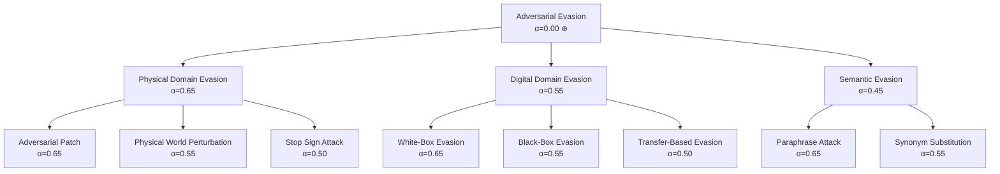

## Adversarial Perturbation Crafting

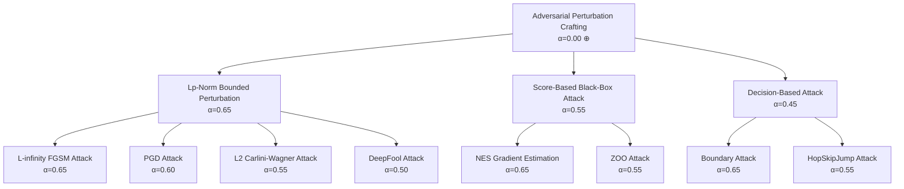

## Data Poisoning

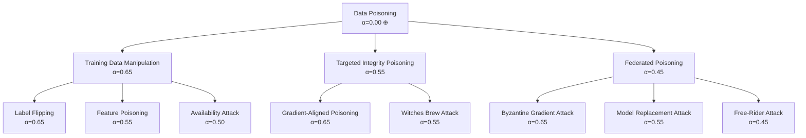

## Backdoor and Trojan Attacks

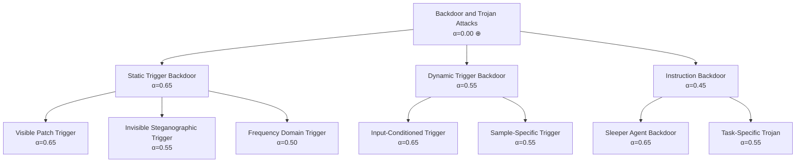

## Model Extraction and Stealing

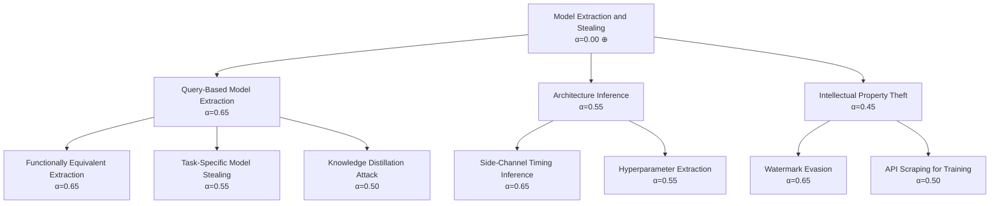

## Membership Inference

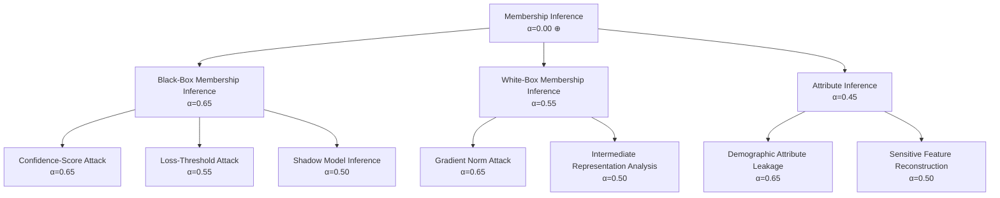

## Model Inversion and Data Reconstruction

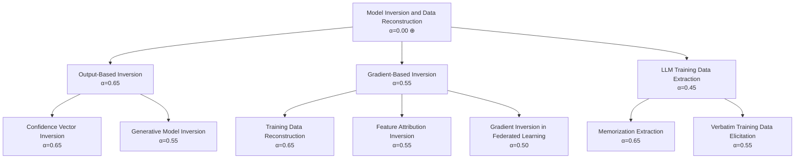

## Prompt Injection and LLM Exploitation

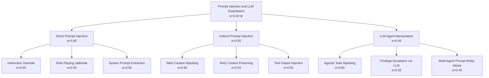

## ML Reconnaissance

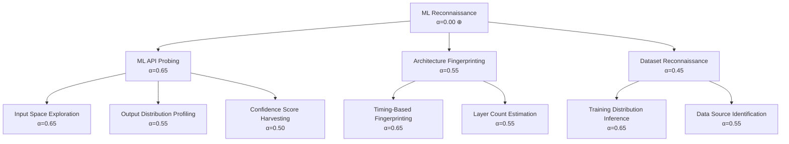

## ML Supply Chain Attack

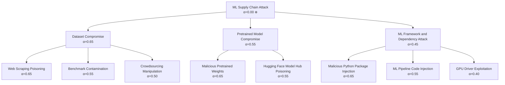

## Adversarial Robustness Degradation

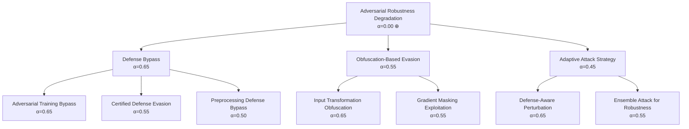

## ML Model Access and Initial Compromise

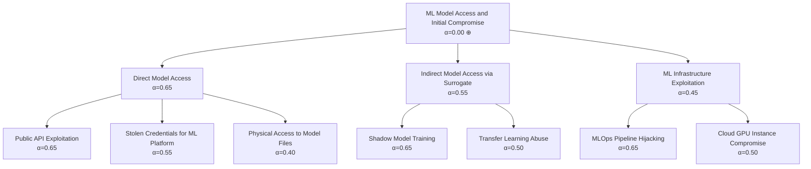

## ML Exfiltration

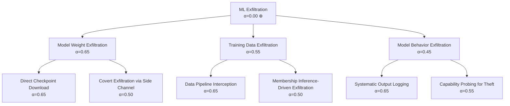
